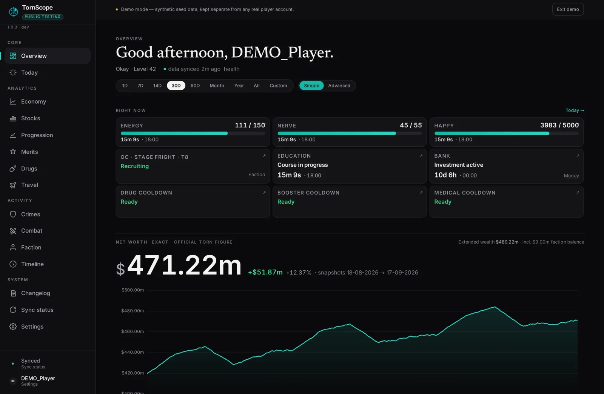
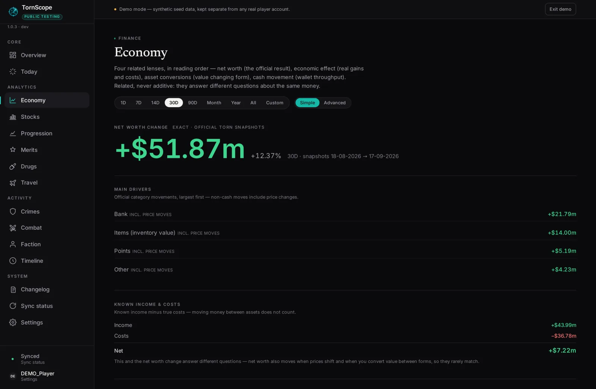
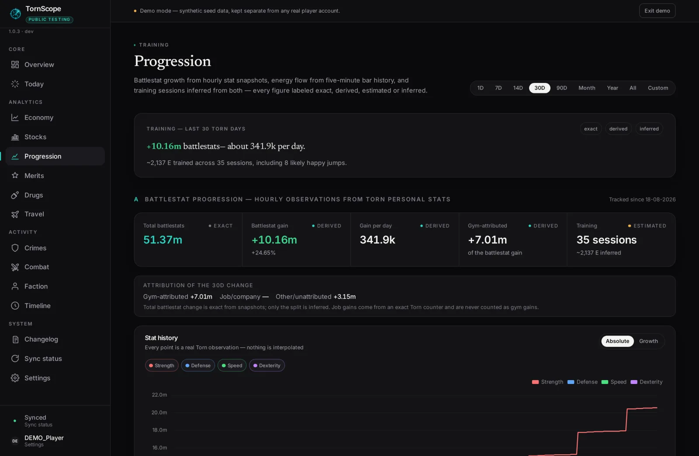
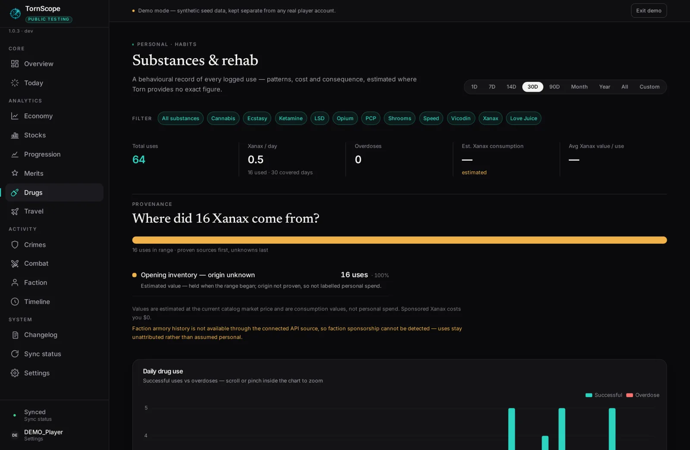
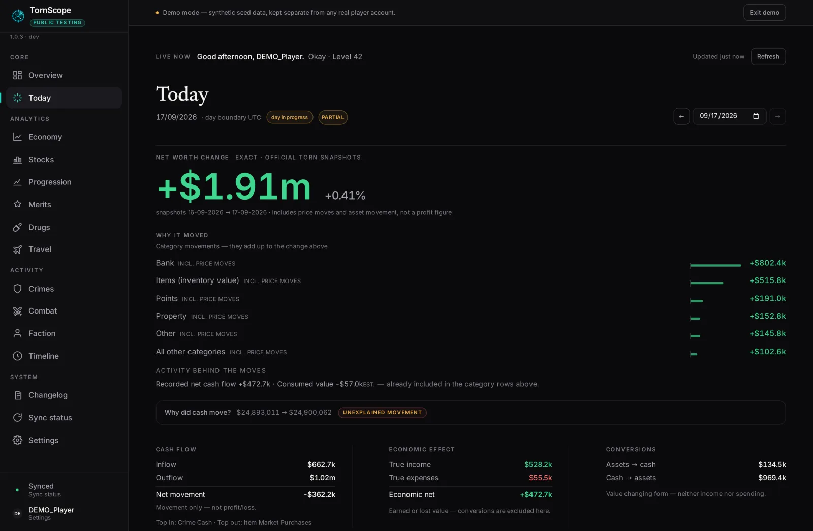
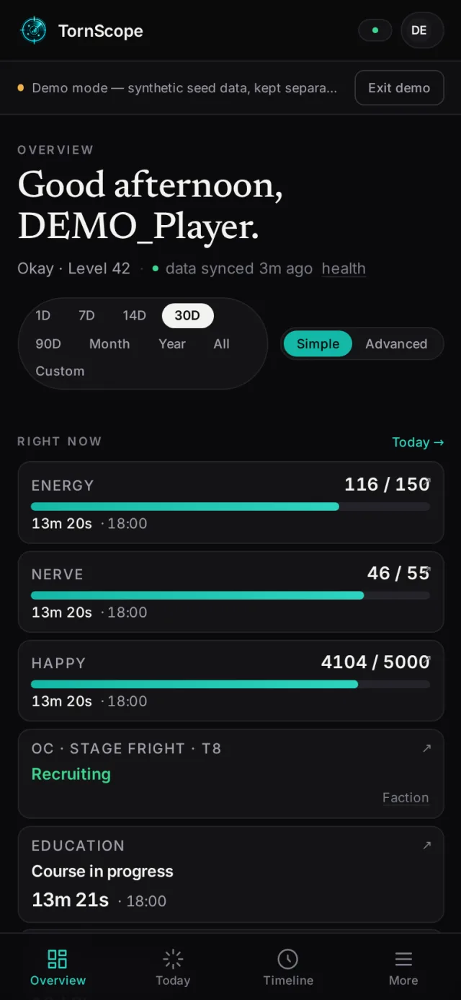
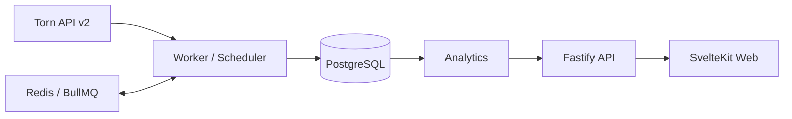

# TornScope

**Historical intelligence for Torn.**

TornScope is a self-hostable [Torn](https://www.torn.com) analytics and history platform. Connect a Torn API key and it continuously collects account data, stores what Torn cannot reconstruct later, and turns it into useful historical insight — net worth trends, training progression, drug and rehab history, travel economics, combat and crime records, and more.



| | |
| --- | --- |
| **Version** | 1.0.x — [Public Testing](https://tornscope.cyxno.eu) |
| **CI** | [GitHub Actions](.github/workflows/ci.yml): lint, typecheck, svelte-check, tests, build, Docker smoke |
| **Docker images** | [](https://github.com/Cyxno?tab=packages&repo_name=tornscope) published per release — web / api / worker |
| **Runtime** | Docker Compose (Node ≥ 20.19, PostgreSQL, Redis) |
| **License** | [MIT](LICENSE) |
| **Demo** | Synthetic demo profile — explore without a real API key |

**[Try the live instance →](https://tornscope.cyxno.eu)** · **[Quick Start](#quick-start)** · **[Features](#features)** · **[Screenshots](#screenshots)**

## What is TornScope?

The Torn API shows the *present*. It does not give you your financial history, drug usage patterns, travel profitability, or net-worth trends over time — and Torn's log retention is limited, so some data can never be reconstructed later.

TornScope treats **historical data as a first-class concern**. A background worker continuously pulls from the Torn API and stores everything as:

- **Events** — individual historical occurrences: drug use, rehab visits, flights, item purchases, money movements.
- **Snapshots** — point-in-time state: net worth breakdowns, personal stats, bars.

Both are append-only, deduplicated, and stored in PostgreSQL from your very first successful sync. Analytics then run against that growing history — which is why starting collection early matters.

And since 2.0, that history works for you: **TornScope 1.0 records your Torn history — TornScope 2.0 turns that history into intelligence.**

## Why TornScope?

- **History, not a mirror.** Every figure is computed from stored history, not from whatever the API happens to return today.
- **Honest numbers.** Every figure carries a confidence label (exact / derived / estimated / inferred) and unavailable data renders as "—" — never as a fake zero.
- **Wealth-first financial model.** Cash moving into items, stocks or the bank is *not* a loss. TornScope separates real income and costs from asset conversions and wallet movement.
- **Actionable live state.** The Overview's "Right now" board shows bars, travel, OC, education, bank and cooldowns with countdowns and direct actions into Torn — and the Command Center feed above it prioritizes what actually needs attention right now.
- **Intelligence with honesty.** Personal goals project a finish date from your own trend (withheld when the data doesn't support it), insights compare measured periods instead of guessing, and every figure keeps its confidence label.
- **Self-hosted.** Your database, your keys, your data.

## Screenshots

All screenshots use TornScope's synthetic demo profile — no real account data.

| Overview (dark) | Economy |
| --- | --- |
|  |  |

| Progression | Drugs |
| --- | --- |
|  |  |

| Today (desktop) | Today (mobile, 390px) |
| --- | --- |
|  |  |

## Features

### Overview
Wealth-first dashboard: official net worth with extended wealth, historical chart, Today's story as a signed ledger, and the **Right now** board — live Energy/Nerve/Happy bars with full-time countdowns, travel state and landing time, organized crime, education, bank investment (stays visible until you collect), cooldowns — each card a direct action into Torn, with TornScope analytics one click behind.

### Intelligence (2.0)
**Command Center** — a prioritized attention feed: energy capped, cooldowns ready, bank matured, travel landing, OC almost ready, goals at a milestone, the strongest insight, data-health warnings. Deterministic rules, one entry per fact, per-priority caps.
**Goals & projections** — targets for net worth, liquid wealth, battle stats and level, with an honest ETA from your 7/30/90-day trend (confidence shown; no ETA when history is short, flat or noisy).
**Insights** — a curated, fully deterministic engine: income/spending shifts vs your baseline, travel profit swings, rehab highs, xanax usage changes, training efficiency shifts, personal records. Every insight names its comparison, evidence window and sample size.
**Training & wealth intelligence** — 7d vs 7d vs 30-day training comparisons with personal bests; wealth velocity, a 30-day trend projection, wealth attribution (conversions are never losses) and all-time financial records.

### Today
The live current-state view: bars with regen and full-at times, cooldown countdowns, travel state, city-bank investment maturity, education progress, hospital/jail notices, and a merged upcoming-events timeline. State changes are handled server-side so the same payload renders identically on every page.

### Economy
Four related lenses over the same money — net worth (the official result), economic effect (real gains and costs), asset conversions (value changing form) and cash movement — with wallet reconciliation. Cash moving into items/stocks/bank is never counted as a loss; earned income and conversions are labeled separately.

### Progression & Gym
Battlestat growth from hourly snapshots, an energy ledger from five-minute bar history, and training sessions inferred from both — with gain-per-energy vs your own baselines, Xanax attribution and happy-jump inference. Every figure is labeled exact, derived, estimated or inferred.

### Stocks
Positions valued at current market prices, benefit blocks (reached/next), missing shares with estimated cost, derived payout timing, estimated reward value, annual benefit, yield and payback.

### Merits
The full merit ledger: exact ranks, unspent points, category concentration, maxed/partial/untouched states, per-merit descriptions from Torn's catalog, search and filters.

### Drugs & Rehab
Daily drug use (good/bad), per-drug breakdown, estimated spend from market prices, overdose rate, and rehab history and spend.

### Travel
Trips assembled from logs, estimated profit per trip/hour/destination (clearly labeled estimates), plushie/flower/other splits, and the current travel state.

### Combat & Crimes
Attack history (outgoing/incoming, win/loss semantics from your perspective) and crime analytics from your logs.

### Timeline
A unified chronological feed of logs and events with amounts, filterable and paginated.

### Notifications
Web Push with a canonical notification-type registry, **iOS/iPadOS home-screen PWA support**, multiple devices per profile, test push, quiet hours that defer instead of dropping, per-profile dedupe, and a delivery ledger that explains every suppressed, expired or failed alert. Dead subscriptions are cleaned up automatically.

### Appearance
Dark/light/system themes, curated canvas presets (Graphite for dark, Paper for light), accent colors, chart palettes (including colorblind-friendly and monochrome), density and motion preferences — applied before first paint, stored per browser.

### Changelog
TornScope ships with a built-in, honest changelog page (`/changelog`) built from real release history.

### Demo mode
A dedicated synthetic demo profile with 180+ days of populated history, kept strictly separate from real accounts (`source = 'demo'`, never calls Torn). See [Demo mode](#demo-mode-1).

### Feature summary

| Area | Highlights |
| --- | --- |
| Overview | Net worth, extended wealth, Right now action board, Command Center feed |
| Today | Live bars, cooldowns, travel, upcoming events |
| Economy | Cash, assets, true income/cost, reconciliation |
| Progression | Stats, training sessions, energy ledger, happy jumps |
| Stocks | Portfolio, benefit blocks, yield and payback |
| Merits | Full merit ledger, ranks, unspent points |
| Travel | Trip history and destination economics |
| Drugs | Usage, spend, overdoses, rehab history |
| Combat & Crimes | Attack and crime history from your logs |
| Timeline | Unified chronological ledger |
| Intelligence | Goals & projections, insights, training & wealth intelligence, system health |
| Notifications | Web Push (incl. iOS PWA), quiet hours, devices, ledger, goal/OC/insight rules |
| Demo | Synthetic populated account, no real data |

## How it works



- The **worker** pulls from the Torn API v2 incrementally (per-resource schedules and cursors — never re-fetching what is already stored) through a client-side rate limiter that respects Torn's 100 req/min cap.
- Raw log entries are **normalized** into typed events (drug, rehab, travel, money, timeline, combat, crimes) and stored alongside snapshots. Unique constraints make ingestion idempotent — overlaps and crashes never duplicate history.
- **Analytics** are pure functions over the stored history, so every figure is reproducible from the database.
- The **Fastify API** exposes typed, paginated, Zod-validated endpoints; the **SvelteKit web app** renders them into the dashboards shown above.

## Requirements

- Docker + Docker Compose (recommended), **or**
- Node.js ≥ 20.19, PostgreSQL 14+, Redis 6+, pnpm ≥ 10

## Docker images

The application images are published to the GitHub Container Registry on every release — installing TornScope needs **only Docker**, no Node/pnpm toolchain:

| Image | Purpose |
| --- | --- |
| `ghcr.io/cyxno/tornscope-web` | SvelteKit frontend |
| `ghcr.io/cyxno/tornscope-api` | Fastify API and database migration runtime |
| `ghcr.io/cyxno/tornscope-worker` | BullMQ synchronization and notification worker |

PostgreSQL and Redis intentionally keep their official upstream images — TornScope publishes only its own three application images.

**Tags** (all three images are tagged identically per release):

| Tag | Meaning |
| --- | --- |
| `2.0.4` | Exact release — **recommended**, pin it via `TORNSCOPE_VERSION` in `.env` |
| `1` / `1.0` | Rolling major / minor line — moves with new releases |
| `latest` | Current stable release |
| `<full-commit-sha>` | Built from exactly that commit — matches the API's `x-tornscope-build` header for exact reproducibility |

- Multi-arch: images are built for **`linux/amd64` and `linux/arm64`** (x86 servers, ARM homelabs, Raspberry Pi-class hosts, Apple Silicon Linux VMs).
- The floating tags (`latest`, `1`, `1.0`) only move after **all three** images of a release have published — `latest` is never a partially-released mix.
- Published version tags are immutable in practice and never re-pointed.

## Quick Start

**Linux / macOS:**

```bash
git clone https://github.com/Cyxno/tornscope.git tornscope && cd tornscope
cp .env.example .env

# Database password (hex: URL-safe, no quoting or encoding pitfalls)
sed -i.bak "s/^POSTGRES_PASSWORD=.*/POSTGRES_PASSWORD=$(openssl rand -hex 16)/" .env && rm .env.bak

# API key encryption master key (32 bytes = 64 hex chars, AES-256-GCM)
sed -i.bak "s/^API_KEY_ENCRYPTION_KEY=.*/API_KEY_ENCRYPTION_KEY=$(openssl rand -hex 32)/" .env && rm .env.bak

docker compose pull
docker compose up -d
```

**Windows PowerShell** (5.1 or later):

```powershell
git clone https://github.com/Cyxno/tornscope.git tornscope
cd tornscope
Copy-Item .env.example .env

$rng = [System.Security.Cryptography.RandomNumberGenerator]::Create()
$pgBytes  = [byte[]]::new(16); $rng.GetBytes($pgBytes)   # database password
$keyBytes = [byte[]]::new(32); $rng.GetBytes($keyBytes)  # AES-256 master key
$pgPassword = -join ($pgBytes  | ForEach-Object { $_.ToString("x2") })
$masterKey  = -join ($keyBytes | ForEach-Object { $_.ToString("x2") })

(Get-Content .env -Encoding UTF8) | ForEach-Object {
  $_ -replace '^POSTGRES_PASSWORD=.*$', "POSTGRES_PASSWORD=$pgPassword" -replace '^API_KEY_ENCRYPTION_KEY=.*$', "API_KEY_ENCRYPTION_KEY=$masterKey"
} | Set-Content .env -Encoding UTF8

docker compose pull
docker compose up -d
```

Both variants generate `POSTGRES_PASSWORD` (the database password) and `API_KEY_ENCRYPTION_KEY` (the AES-256-GCM master key that protects stored API keys) and write them straight into `.env` — no copy/pasting secrets. Every other value keeps its localhost default, which works out of the box. Compose pulls the published GHCR images (`TORNSCOPE_VERSION` in `.env` selects the release; `.env.example` pins the current stable).

### Build from source (alternative)

Prefer compiling the images yourself — e.g. for development or an air-gapped tweak? The same Dockerfiles the published images come from build locally; Docker is still the only requirement:

```bash
docker compose -f docker-compose.yml -f docker-compose.build.yml up -d --build
```

`docker-compose.build.yml` only adds the build definitions — runtime configuration is identical either way. Export `GIT_SHA=$(git rev-parse HEAD)` before building if you want the API's `x-tornscope-build` header to report the real commit (otherwise images honestly stamp `dev`).

Then open **http://localhost:5173**, follow the welcome flow and paste your Torn API key (limited permissions work; more access unlocks additional analytics). The worker starts collecting history immediately — first sync covers up to 180 days of available Torn history.

### Web Push notifications (optional)

Notifications need VAPID keys; without them everything else works and push stays disabled. Generate a pair once and put it in `.env`:

```bash
npx web-push generate-vapid-keys
```

```
VAPID_PUBLIC_KEY=...
VAPID_PRIVATE_KEY=...
VAPID_SUBJECT=https://your-domain.example        # or a mailto: on a real domain
```

> TornScope itself does not generate these automatically — they identify your instance to browser push services.

## Configuration

Important variables (defaults work on localhost):

| Variable | Purpose |
| --- | --- |
| `POSTGRES_PASSWORD` | Database password (**required**) |
| `API_KEY_ENCRYPTION_KEY` | 64-hex AES-256-GCM master key (**required**) |
| `DATABASE_URL` / `REDIS_URL` | PostgreSQL and Redis connection strings |
| `APP_BASE_URL` / `API_BASE_URL` | Web origin for CORS / API target for the web proxy |
| `ORIGIN` | Browser-facing origin of the web app (must match what users open) |
| `PUBLIC_BASE_URL` | Public origin (informational + Web Push subject default) |
| `ALLOWED_ORIGINS` | Extra origins accepted for cookie-authenticated mutations |
| `TRUST_PROXY` / `CLIENT_IP_HEADER` / `CLIENT_IP_DEPTH` | Real client-IP resolution behind a reverse proxy |
| `VAPID_PUBLIC_KEY` / `VAPID_PRIVATE_KEY` / `VAPID_SUBJECT` | Web Push (optional) |

The full annotated list lives in [.env.example](.env.example) and [docs/CONFIGURATION.md](docs/CONFIGURATION.md).

## Reverse proxy / HTTPS

TornScope works on `http://localhost:5173` with zero configuration. The moment it is reached any other way — LAN address, reverse proxy, public domain — the origin configuration must match reality, or session-cookie security, CSRF/origin checks, Web Push and per-IP rate limiting silently break.

Public deployment on `https://torn.example.com`:

```bash
APP_BASE_URL=https://torn.example.com
PUBLIC_BASE_URL=https://torn.example.com
ALLOWED_ORIGINS=https://torn.example.com
ORIGIN=https://torn.example.com
```

Full guide — forwarded host/proto, client-IP chain depth, `TRUST_PROXY`, Cloudflare, Nginx Proxy Manager: [docs/REVERSE-PROXY.md](docs/REVERSE-PROXY.md).

## Updating

```bash
git pull
# bump TORNSCOPE_VERSION in .env to the new release (or set `latest` to always track stable)
docker compose pull
docker compose up -d
```

Database migrations apply automatically on startup (the `migrate` service runs before API/worker). Your PostgreSQL volume persists across updates — collected history is kept. Back up before major updates; see [Backup & restore](#backup--restore).

Source-build users: run the same update with `-f docker-compose.yml -f docker-compose.build.yml` and `--build`.

## Backup & restore

The PostgreSQL volume holds history that **may be unrecoverable from Torn later** — schedule backups:

```bash
docker compose exec postgres pg_dump -U tornscope tornscope | gzip > tornscope-$(date +%F).sql.gz
```

Also back up your `.env` — **losing `API_KEY_ENCRYPTION_KEY` means stored Torn API keys can no longer be decrypted** and must be re-connected (history survives, keys don't). Details: [docs/BACKUP.md](docs/BACKUP.md).

## Security & privacy

- API keys are validated against Torn, then encrypted at rest with **AES-256-GCM** (unique IV per save, auth-tag verified). Only the last 4 characters are ever shown again.
- Keys are decrypted only in the service performing outgoing Torn requests — never sent to the browser, never logged (pino redaction + client sanitization).
- Profiles are isolated server-side: each browser session sees only its own data. Sessions use HttpOnly/Secure/SameSite cookies.
- Deleting the key revokes it; collected history is preserved.
- **Access model — read before exposing TornScope:** TornScope has no instance-owner login or invite-only mode. Anyone who can reach your instance can create their own isolated profile and connect a key. For a private instance, put access control in front of it (Authelia/Authentik, Tailscale/VPN, Cloudflare Access, reverse-proxy auth, or localhost-only binding).
- Security posture: Helmet headers, CORS restricted to configured origins, global rate limiting on the real client IP, Zod validation on every input, push-endpoint SSRF validation, keyset pagination, parameterized SQL only, no secrets in logs. More in [SECURITY.md](SECURITY.md).

## Demo mode

```bash
pnpm seed:demo
```

Seeds 180+ days of synthetic history (drugs, rehab, travel, money ledger, net worth snapshots, timeline, organized crimes, notifications) for a dedicated `isDemo = true` user. The UI shows a Demo banner; demo rows are never mixed with real data; re-running replaces demo data only. `pnpm demo:topup` (run automatically by the worker at most every 6 hours) keeps the demo history current without Torn calls.

On the public instance you can explore TornScope with the demo profile — no API key required.

## Live instance

A **Public Testing** instance runs at **[https://tornscope.cyxno.eu](https://tornscope.cyxno.eu)**. You can browse it with the synthetic demo profile, or sign in with your own Torn API key and start collecting your own history. It is a testing deployment, not a guaranteed hosted service — self-hosting is the intended path.

## Tech stack

| Layer | Technology |
| --- | --- |
| Frontend | SvelteKit (Svelte 5), Tailwind CSS, ECharts |
| Backend | Fastify, TypeScript, Zod |
| Worker | BullMQ (Redis) |
| Database | PostgreSQL, Prisma |
| Packaging | Docker Compose |

## Project structure

```
tornscope/
├── apps/
│   ├── web/          SvelteKit 5 + Svelte 5 + Tailwind 4 + ECharts 6
│   ├── api/          Fastify 5 + Zod
│   └── worker/       BullMQ sync workers + scheduler + notification engine
├── packages/
│   ├── torn-api/     Torn API v2 client (rate limiter, retry, error taxonomy,
│   │                 pagination, typed endpoints)
│   ├── database/     Prisma schema + client, repositories, log normalizers,
│   │                 AES-256-GCM encryption service, demo seed
│   ├── analytics/    Pure calculation functions (no I/O)
│   ├── shared/       Branding, date-range presets, Torn constants, API contracts
│   └── ui/           Reserved for shared design tokens
├── docker/           Production Dockerfiles (api, worker, web)
├── docs/             Operational & design documentation, screenshots
└── docker-compose.yml
```

## Known limitations

- **History starts when you start.** Torn's log retention is limited — events older than your first sync cannot be recovered.
- **Open access model** — no built-in instance login; restrict access externally for private instances (see [Security & privacy](#security--privacy)).
- **Single-node Compose** design; not a horizontally scaled deployment.
- Some figures are **estimated or inferred by nature** (travel profit, drug spend, training sessions) and are always labeled as such.
- **Web Push on iOS/iPadOS** requires installing TornScope as a home-screen PWA (iOS 16.4+); browser tabs on iOS do not expose push.
- Torn's **rate limits** (100 req/min) cap how fast history syncs; initial sync takes a few minutes.

## Changelog & releases

- In-app: the **Changelog** page (`/changelog`) documents every release.
- Repository: tagged releases and [docs/RELEASE-NOTES-1.0.0.md](docs/RELEASE-NOTES-1.0.0.md).

## Development

```bash
pnpm install
cp .env.example .env        # fill DATABASE_URL, REDIS_URL, API_KEY_ENCRYPTION_KEY
docker compose up -d postgres redis
pnpm db:migrate && pnpm db:generate

pnpm dev        # tsc watch + api + worker + web (vite) concurrently
pnpm test       # vitest — analytics, normalization, live-state logic,
                #  encryption, client retry/pagination, security regressions
pnpm typecheck  # strict TypeScript across all packages
pnpm check:web  # svelte-check
```

Dev URL: http://localhost:5173 — `/api/*` is proxied to the Fastify server on :3000.

## Roadmap

See the repository's [issue tracker](https://github.com/Cyxno/tornscope/issues) for the current backlog.

## Contact & support

TornScope is maintained by **Cyxno** — reach out on Torn: [profiles.php?XID=1816206](https://www.torn.com/profiles.php?XID=1816206), or open a GitHub Issue for bugs and self-hosting questions.

## Disclaimer

TornScope is an independent community project — not operated, endorsed, or hosted by Torn. "Torn" and related marks belong to their respective owners.

## License

[MIT](LICENSE)
